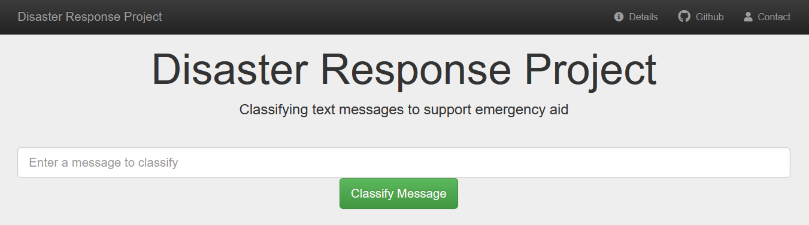

  
  
   
  
  
  
  
   
  
  
  

  

# Disaster Response Project
Applied machine learning project on text classification for quick aid delivery.

This repository contains material related to a previous class project that aimed to deliver a machine learning-based model for text classification to support the coordination of aid efforts during a natural disaster.

The developed model was also incorporated into a web application that is available at

  <a href="https://disaster-response-txt-app.herokuapp.com"><strong>https://disaster-response-txt-app.herokuapp.com</strong></a>

The [training branch](https://github.com/chris-hoffmann/disaster_response/tree/training) of this repository contains python code for processing raw data, hyperparameter tuning, and model evaluation thereby enabling full reproducibility.
